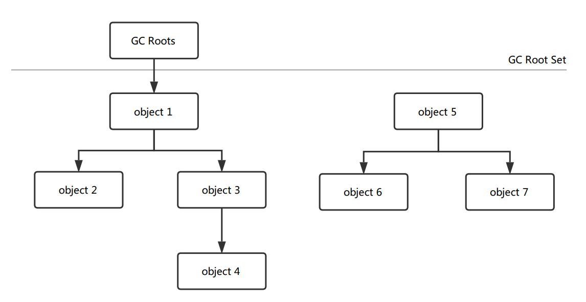

### 可达性分析算法
在主流的商用程序语言（Java）的主流实现中，都是称通过可达性分析来判定对象是否存活的。这个算法的基本思路就是通过一系列的称为“GC Roots”的对象作为起始点，从这些节点开始向下搜索，搜索所走过的路径称为引用链，当一个对象到GC Roots没有任何引用链相连（用图论的话来说，就是从GC Roots到这个对象不可达）时，则证明此对象是不可用的。如图所示，对象object5、object6、object7虽然互相有关联，但是它们到GC Roots是不可达的，所以它们将会被判定为是可回收的对象。

在Java语言中，可作为GC Roots的对象包括下面几种：
* 虚拟机栈（栈帧中的本地变量表）中引用的对象。
* 方法区中类静态属性引用的对象。
* 方法区中常量引用的对象。
* 本地方法栈中JNI（即一般说的Native方法）引用的对象。
