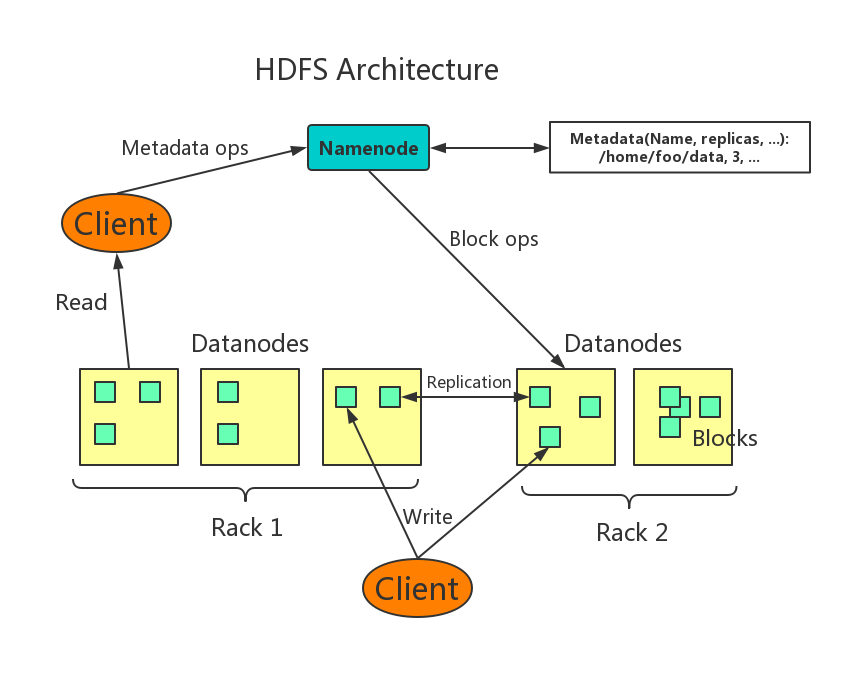
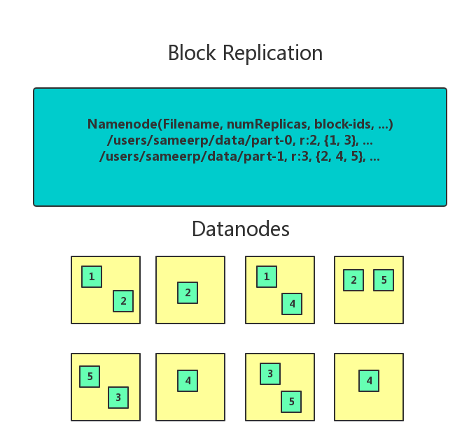

# HDFS
## Introduction
The Hadoop Distributed File System (HDFS) is a distributed file system designed to run on commodity hardware.  
HDFS is highly fault-tolerant and is designed to be deployed on low-cost hardware.  
HDFS provides high throughput access to application data and is suitable for applications that have large data sets.

## Assumptions and Goals
### Hardware Failure
Hardware failure is the norm rather than the exception.  
An HDFS instance may consist of hundreds or thousands of server machines, each storing part of the file system’s data.  
The fact that there are a huge number of components and that each component has a non-trivial probability of failure means that some component of HDFS is always non-functional.  
Therefore, detection of faults and quick, automatic recovery from them is a core architectural goal of HDFS.
### Streaming Data Access
Applications that run on HDFS need streaming access to their data sets.  
They are not general purpose applications that typically run on general purpose file systems.  
HDFS is designed more for batch processing rather than interactive use by users.  
The emphasis is on high throughput of data access rather than low latency of data access.

### Large Data Sets
Applications that run on HDFS have large data sets.  
A typical file in HDFS is gigabytes to terabytes in size.  
Thus, HDFS is tuned to support large files.  
It should provide high aggregate data bandwidth and scale to hundreds of nodes in a single cluster.  
It should support tens of millions of files in a single instance.
### Simple Coherency Model
HDFS applications need a write-once-read-many access model for files.  
A file once created, written, and closed need not be changed except for appends and truncates.  
Appending the content to the end of the files is supported but cannot be updated at arbitrary point.  
This assumption simplifies data coherency issues and enables high throughput data access.
### “Moving Computation is Cheaper than Moving Data”
A computation requested by an application is much more efficient if it is executed near the data it operates on.  
This is especially true when the size of the data set is huge.  
This minimizes network congestion and increases the overall throughput of the system.  
The assumption is that it is often better to migrate the computation closer to where the data is located rather than moving the data to where the application is running.  
HDFS provides interfaces for applications to move themselves closer to where the data is located.
### Portability Across Heterogeneous Hardware and Software Platforms
HDFS has been designed to be easily portable from one platform to another.  
This facilitates widespread adoption of HDFS as a platform of choice for a large set of applications.
## NameNode and DataNodes
HDFS has a master/slave architecture.  
An HDFS cluster consists of a single NameNode, a master server that manages the file system namespace and regulates access to files by clients.  
In addition, there are a number of DataNodes, usually one per node in the cluster, which manage storage attached to the nodes that they run on.  
HDFS exposes a file system namespace and allows user data to be stored in files.  
Internally, a file is split into one or more blocks and these blocks are stored in a set of DataNodes.  
The NameNode executes file system namespace operations like opening, closing, and renaming files and directories.  
It also determines the mapping of blocks to DataNodes.  
The DataNodes are responsible for serving read and write requests from the file system’s clients.  
The DataNodes also perform block creation, deletion, and replication upon instruction from the NameNode.

The NameNode and DataNode are pieces of software designed to run on commodity machines.  
These machines typically run a GNU/Linux operating system (OS).  
HDFS is built using the Java language; any machine that supports Java can run the NameNode or the DataNode software.  
Usage of the highly portable Java language means that HDFS can be deployed on a wide range of machines.  
A typical deployment has a dedicated machine that runs only the NameNode software.  
Each of the other machines in the cluster runs one instance of the DataNode software.  
The architecture does not preclude running multiple DataNodes on the same machine but in a real deployment that is rarely the case.  

The existence of a single NameNode in a cluster greatly simplifies the architecture of the system.  
The NameNode is the arbitrator and repository for all HDFS metadata.  
The system is designed in such a way that user data never flows through the NameNode.

## The File System Namespace
HDFS supports a traditional hierarchical file organization.  
A user or an application can create directories and store files inside these directories.  
The file system namespace hierarchy is similar to most other existing file systems; one can create and remove files, move a file from one directory to another, or rename a file.  

The NameNode maintains the file system namespace.  
Any change to the file system namespace or its properties is recorded by the NameNode.  
An application can specify the number of replicas of a file that should be maintained by HDFS.  
The number of copies of a file is called the replication factor of that file.  
This information is stored by the NameNode.
## Data Replication
HDFS is designed to reliably store very large files across machines in a large cluster.  
It stores each file as a sequence of blocks.  
The blocks of a file are replicated for fault tolerance.  
The block size and replication factor are configurable per file.

All blocks in a file except the last block are the same size.

An application can specify the number of replicas of a file.  
The replication factor can be specified at file creation time and can be changed later.  

The NameNode makes all decisions regarding replication of blocks.  
It periodically receives a Heartbeat and a Blockreport from each of the DataNodes in the cluster.  
Receipt of a Heartbeat implies that the DataNode is functioning properly.  
A Blockreport contains a list of all blocks on a DataNode.

## Data Organization
### Data Blocks
HDFS is designed to support very large files.  
Applications that are compatible with HDFS are those that deal with large data sets.  
These applications write their data only once but they read it one or more times and require these reads to be satisfied at streaming speeds.  
HDFS supports write-once-read-many semantics on files. A typical block size used by HDFS is 128 MB.  
Thus, an HDFS file is chopped up into 128 MB chunks, and if possible, each chunk will reside on a different DataNode.
### Replication Pipelining
When a client is writing data to an HDFS file with a replication factor of three, the NameNode retrieves a list of DataNodes using a replication target choosing algorithm.  
This list contains the DataNodes that will host a replica of that block.  
The client then writes to the first DataNode.  
The first DataNode starts receiving the data in portions, writes each portion to its local repository and transfers that portion to the second DataNode in the list.  
The second DataNode, in turn starts receiving each portion of the data block, writes that portion to its repository and then flushes that portion to the third DataNode.  
Finally, the third DataNode writes the data to its local repository.  
Thus, a DataNode can be receiving data from the previous one in the pipeline and at the same time forwarding data to the next one in the pipeline.  
Thus, the data is pipelined from one DataNode to the next.

