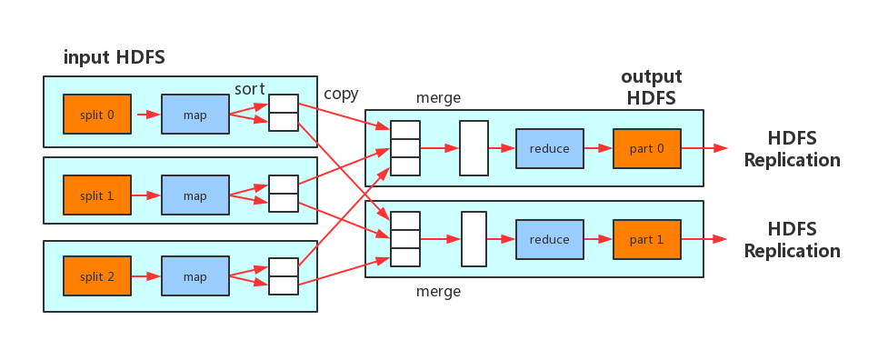

# MapReduce
MapReduce作业（job）是客户端需要执行的一个工作单元：它包括输入数据、MapReduce程序和配置信息。Hadoop将作业分成若干个任务（task）来执行，其中包括两类任务：map任务和reduce任务。这些任务运行在集群的节点上，并通过YARN进行调度。如果一个任务失败，它将在另一个不同的节点上自动重新调度运行。  
Hadoop将MapReduce的输入数据划分成等长的小数据块，称为输入分片（input split）或简称“分片”。Hadoop为每个分片构建一个map任务，并由该任务来运行用户自定义的map函数从而处理分片中的每条记录。  
The framework then calls map() for each key/value pair in the InputSplit for that task.  
对于大多数作业来说，一个合理的分片大小趋向于HDFS的一个块的大小，默认是128MB，不过可以针对集群调整这个默认值（对所有新建的文件），或在每个文件创建时指定。  
Hadoop在存储有输入数据（HDFS中的数据）的节点上运行map任务，可以获得最佳性能，因为它无需使用宝贵的集群带宽资源。这就是所谓的“数据本地化优化”。  

现在我们应该清楚为什么最佳分片的大小应该与块大小相同：因为它是确保可以存储在单个节点上的最大输入块的大小。如果分片跨越两个数据块，那么对于任何一个HDFS节点，基本上都不可能同时存储这两个数据块，因此分片中的部分数据需要通过网络传输到map任务运行的节点。与使用本地数据运行整个map任务相比，这种方法显然效率更低。  

map任务将其输出写入本地硬盘，而非HDFS。这是为什么？因为map的输出是中间结果：该中间结果由reduce任务处理后才产生最终输出结果，而且一旦作业完成，map的输出结果就可以删除。因此，如果把它存储在HDFS中并实现备份，难免有些小题大做。如果运行map任务的节点在将map中间结果传送给reduce任务之前失败，Hadoop将在另一个节点上重新运行这个map任务以再次构建map中间结果。  

reduce任务并不具备数据本地化的优势，单个reduce任务的输入通常来自于所有mapper的输出。因此，排过序的map输出需通过网络传输发送到运行reduce任务的节点。数据在reduce端合并，然后由用户定义的reduce函数处理。reduce的输出通常存储在HDFS中以实现可靠存储。  

reduce任务的数量并非由输出数据的大小决定，相反是独立指定的。  

如果有好多个reduce任务，每个map任务就会针对输出进行分区（partition），即为每个reduce任务建一个分区。每个分区有许多键（及其对应的值），但每个键对应的键-值对记录都在同一分区中。分区可由用户定义的分区函数控制，但通常用默认的partitioner通过哈希函数来分区，很高效。  

一般情况下，多个reduce任务的数据流如图所示。该图清楚地表明了为什么map任务和reduce任务之间的数据流称为shuffle，因为每个reduce任务的输入都来自许多map任务。shuffle一般比图中所示的更复杂。  

## combiner函数
集群上的可用带宽限制了MapReduce作业的数量，因此尽量避免map和reduce任务之间的数据传输是有利的。Hadoop允许用户针对map任务的输出指定一个combiner，combiner函数的输出作为reduce函数的输入。  

假设计算最高气温。  
假设第一个map的输出如下：  
(1950, 0)  
(1950, 20)  
(1950, 10)  
第二个map的输出如下：  
(1950, 25)  
(1950, 15)  
reduce函数被调用时，输入如下：  
(1950, [0, 20, 10, 25, 15])  
因为25为该列数据中最大的，所以它的输出如下：  
(1950, 25)  
我们可以像使用reduce函数那样，使用combiner找出每个map任务输出结果中的最高气温。如此一来，reduce函数调用时将被传入以下数据：  
(1950, [20, 25])  
reduce输出的结果和以前一样。  

combiner是通过Reducer类来定义的。
