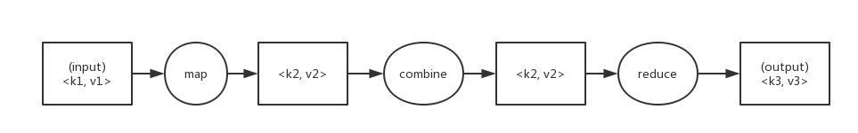

# MapReduce
## map和reduce
MapReduce任务过程分为两个处理阶段：map阶段和reduce阶段。每阶段都以键-值对作为输入和输出，其类型由程序员来选择。程序员还需要写两个函数：map函数和reduce函数。  
map函数的输出经由MapReduce框架处理后，最后发送到reduce函数。这个处理过程基于键来对键-值对进行排序和分组。  

## Java MapReduce
```java
import java.io.IOException;
import java.util.StringTokenizer;

import org.apache.hadoop.conf.Configuration;
import org.apache.hadoop.fs.Path;
import org.apache.hadoop.io.IntWritable;
import org.apache.hadoop.io.Text;
import org.apache.hadoop.mapreduce.Job;
import org.apache.hadoop.mapreduce.Mapper;
import org.apache.hadoop.mapreduce.Reducer;
import org.apache.hadoop.mapreduce.lib.input.FileInputFormat;
import org.apache.hadoop.mapreduce.lib.output.FileOutputFormat;

public class WordCount {

  public static class TokenizerMapper extends Mapper<Object, Text, Text, IntWritable> {

    private final static IntWritable one = new IntWritable(1);
    private Text word = new Text();

    public void map(Object key, Text value, Context context) throws IOException, InterruptedException {
      StringTokenizer itr = new StringTokenizer(value.toString());
      while (itr.hasMoreTokens()) {
        word.set(itr.nextToken());
        context.write(word, one);
      }
    }
  }

  public static class IntSumReducer extends Reducer<Text,IntWritable,Text,IntWritable> {
    private IntWritable result = new IntWritable();

    public void reduce(Text key, Iterable<IntWritable> values, Context context) throws IOException, InterruptedException {
      int sum = 0;
      for (IntWritable val : values) {
        sum += val.get();
      }
      result.set(sum);
      context.write(key, result);
    }
  }

  public static void main(String[] args) throws Exception {
    Configuration conf = new Configuration();
    Job job = Job.getInstance(conf, "word count");
    job.setJarByClass(WordCount.class);
    job.setMapperClass(TokenizerMapper.class);
    job.setCombinerClass(IntSumReducer.class);
    job.setReducerClass(IntSumReducer.class);
    job.setOutputKeyClass(Text.class);
    job.setOutputValueClass(IntWritable.class);
    FileInputFormat.addInputPath(job, new Path(args[0]));
    FileOutputFormat.setOutputPath(job, new Path(args[1]));
    System.exit(job.waitForCompletion(true) ? 0 : 1);
  }
}
```
明白MapReduce程序的工作原理之后，下一步就是写代码实现它。我们需要三样东西：一个map函数、一个reduce函数和一些用来运行作业的代码。  

map函数由Mapper类来表示，后者声明一个抽象的map()方法。  
这个Mapper类是一个泛型类型，它有四个形参类型，分别指定map函数的输入键、输入值、输出键和输出值的类型。  
Hadoop本身提供了一套可优化网络序列化传输的基本类型，而不直接使用Java内嵌的类型。这些类型都在org.apache.hadoop.io包中。  
这里使用Text类型（相当于Java中的String类型）和IntWritable类型（相当于Java的Integer类型）。  
map()方法的输入是一个键和一个值。map()方法还提供Context实例用于输出内容的写入。  

以类似方法用Reducer来定义reduce函数。  
同样，reduce函数也有四个形式参数类型用于指定输入和输出类型。reduce函数的输入类型必须匹配map函数的输出类型。  

第三部分代码负责运行MapReduce作业。  
Job对象指定作业执行规范。我们可以用它来控制整个作业的运行。我们在Hadoop集群上运行这个作业时，要把代码打包成一个JAR文件。不必明确指定JAR文件的名称，在Job对象的setJarByClass()方法中传递一个类即可，Hadoop利用这个类来查找包含它的JAR文件，进而找到相关的JAR文件。  
args[0]、args[1]
```java
FileInputFormat.addInputPath(job, new Path(args[0]));
FileOutputFormat.setOutputPath(job, new Path(args[1]));
```
构造Job对象之后，需要指定输入和输出数据的路径。  
调用FileInputFormat类的静态方法addInputPath()来定义输入数据的路径，这个路径可以是单个的文件、一个目录（此时，将目录下所有文件当作输入）或符合特定文件模式的一系列文件。由函数名可知，可以多次调用addInputPath()来实现多路径的输入。  

调用FileOutputFormat类中的静态方法setOutputPath()来指定输出路径（只能有一个输出路径）。  
这个方法指定的是reduce函数输出文件的写入目录。在运行作业前该目录是不应该存在的，否则Hadoop会报错并拒绝运行作业。  
接着，通过setMapperClass()和setReducerClass()方法指定要用的map类型和reduce类型。  
setOutputKeyClass()和setOutputValueClass()方法控制reduce函数的输出类型，并且必须和Reduce类产生的相匹配。map函数的输出类型默认情况下和reduce函数是相同的，因此如果mapper产生出和reducer相同的类型时，不需要单独设置。但是，如果不同，则必须通过setMapOutputKeyClass()和setMapOutputValueClass()方法来设置map函数的输出类型。  

输入的类型通过输入格式来控制，我们的例子中没有设置，因为使用的是默认的TextInputFormat（文本输入格式）。  
TextInputFormat: An InputFormat for plain text files. Files are broken into lines. Either linefeed or carriage-return are used to signal end of line. Keys are the position in the file, and values are the line of text.  

在设置定义map和reduce函数的类之后，可以开始运行作业。Job中的waitForCompletion()方法提交作业并等待执行完成。该方法唯一的参数是一个标识，指示是否已生成详细输出。当标识为true时，作业会把其进度信息写到控制台。  

waitForCompletion()方法返回一个布尔值，表示执行的成败，这个布尔值被转换成程序的退出代码0或者1。
