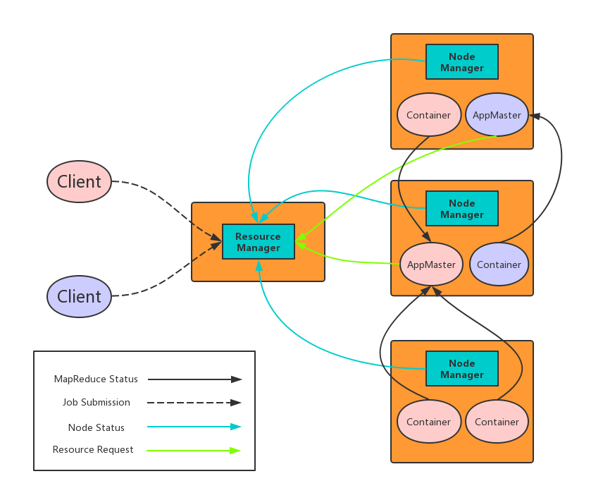

# YARN
The fundamental idea of YARN is to split up the functionalities of resource management and job scheduling/monitoring into separate daemons.  
The idea is to have a global ResourceManager (RM) and per-application ApplicationMaster (AM).  
An application is either a single job or a DAG of jobs.

The ResourceManager and the NodeManager form the data-computation framework.  
The ResourceManager is the ultimate authority that arbitrates resources among all the applications in the system.  
The NodeManager is the per-machine framework agent who is responsible for containers, monitoring their resource usage (cpu, memory, disk, network) and reporting the same to the ResourceManager/Scheduler.

The per-application ApplicationMaster is, in effect, a framework specific library and is tasked with negotiating resources from the ResourceManager and working with the NodeManager(s) to execute and monitor the tasks.

The ResourceManager has two main components: Scheduler and ApplicationsManager.

The Scheduler is responsible for allocating resources to the various running applications subject to familiar constraints of capacities, queues etc.  
The Scheduler is pure scheduler in the sense that it performs no monitoring or tracking of status for the application.  
Also, it offers no guarantees about restarting failed tasks either due to application failure or hardware failures.  
The Scheduler performs its scheduling function based on the resource requirements of the applications; it does so based on the abstract notion of a resource Container which incorporates elements such as memory, cpu, disk, network etc.

The ApplicationsManager is responsible for accepting job-submissions, negotiating the first container for executing the application specific ApplicationMaster and provides the service for restarting the ApplicationMaster container on failure.  
The per-application ApplicationMaster has the responsibility of negotiating appropriate resource containers from the Scheduler, tracking their status and monitoring for progress.
## 剖析YARN应用运行机制
YARN通过两类长期运行的守护进程提供自己的核心服务：管理集群上资源使用的资源管理器（resource manager）、运行在集群中所有节点上且能够启动和监控容器（container）的节点管理器（node manager）。容器用于执行特定应用程序的进程，每个容器都有资源限制（内存、CPU等）。  

为了在YARN上运行一个应用，首先，客户端联系资源管理器，要求它运行一个application master进程。然后，资源管理器找到一个能够在容器中启动application master的节点管理器。准确地说，application master一旦运行起来后能做些什么依赖于应用本身。有可能是在所处的容器中简单地运行一个计算，并将结果返回给客户端；或是向资源管理器请求更多的容器，以用于运行一个分布式计算。后者是MapReduce YARN应用所做的事情。  

注意，YARN本身不会为应用的各部分（客户端、master和进程）彼此间通信提供任何手段。大多数重要的YARN应用使用某种形式的远程通信机制来向客户端传递状态更新和返回结果，但是这些通信机制都是专属于各应用的。

