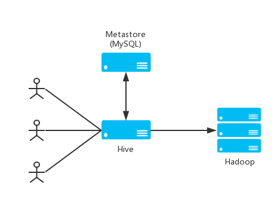

# Apache Hive (TM)
The Apache Hive (TM) data warehouse software facilitates reading, writing, and managing large datasets residing in distributed storage using SQL. Built on top of Apache Hadoop (TM), it provides:  
* Tools to enable easy access to data via SQL, thus enabling data warehousing tasks such as extract/transform/load (ETL), reporting, and data analysis
* A mechanism to impose structure on a variety of data formats
* Access to files stored either directly in Apache HDFS (TM) or in other data storage systems such as Apache HBase (TM)
* Query execution using Apache Hadoop MapReduce, Apache Tez or Apache Spark frameworks

Hive users have a choice of 3 runtimes when executing SQL queries. Users can choose between Apache Hadoop MapReduce, Apache Tez or Apache Spark frameworks as their execution backend. MapReduce is a mature framework that is proven at large scales. However, MapReduce is a purely batch framework, and queries using it may experience higher latencies (tens of seconds), even over small datasets.

Users are free to switch back and forth between these frameworks at any time. In each case, Hive is best suited for use cases where the amount of data processed is large enough to require a distributed system.  

Hive is not designed for online transaction processing. It is best used for traditional data warehousing tasks. Hive is designed to maximize scalability (scale out with more machines added dynamically to the Hadoop cluster), performance, extensibility, fault-tolerance, and loose-coupling with its input formats.  

Metastore（元数据存储）是一个独立的关系型数据库（通常是一个MySQL实例）。
元数据存储中存储了如表的模式等元数据信息。用户在执行如create table x...等命令时会指定这些信息。
