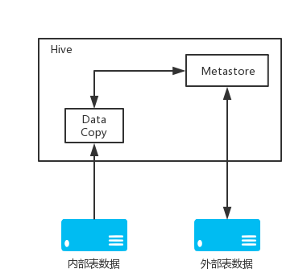

# 管理表外部表

## Feature comparison
* DROP deletes data for managed tables while it only deletes metadata for external ones.
## Managed tables
A managed table is stored under the hive.metastore.warehouse.dir path property.  
If a managed table is dropped, the data and metadata associated with that table are deleted.  
Use managed tables when Hive should manage the lifecycle of the table, or when generating temporary tables.
## External tables
An external table describes the metadata / schema on external files.  
External table files can be accessed and managed by processes outside of Hive.  

Use external tables when files are already present or in remote locations, and the files should remain even if the table is dropped.  