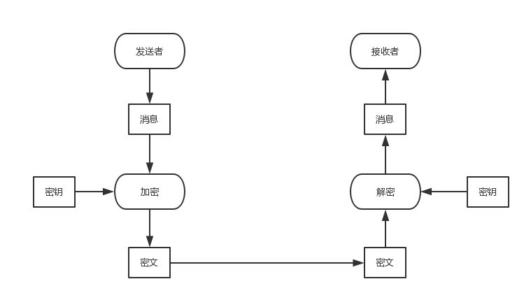

# 对称密码
对称密码，加密和解密的密钥相同。

# 公钥密码
公钥密码，密钥分为加密密钥和解密密钥两种。  
发送者用加密密钥对消息进行加密，接收者用解密密钥对密文进行解密。

公钥密码中，加密密钥一般是公开的。正是由于加密密钥可以任意公开，因此该密钥被称为公钥。  
相对地，解密密钥是绝对不能公开的，这个密钥只能由你自己来使用，因此称为私钥。

公钥和私钥是一一对应的，一对公钥和私钥统称为密钥对。由公钥进行加密的密文，必须使用与该公钥配对的私钥才能够解密。密钥对中的两个密钥之间具有非常密切的关系——数学上的关系——因此公钥和私钥是不能分别单独生成的。

## RSA
RSA是一种公钥密码算法。  
公钥: 数E和数N  
私钥: 数D和数N  
加密: 密文 = 明文^E mod N  
解密: 明文 = 密文^D mod N  
RSA密钥对的生成步骤如下
1. 求N
2. 求L，L是仅在生成密钥对的过程中使用的数
3. 求E
4. 求D

**求N**  
准备两个很大的质数p和q。  
N = pq

**求L**  
L = lcm(p-1,q-1)  
L是p-1和q-1的最小公倍数  
lcm: 最小公倍数

**求E**  
1<E<L  
gcd(E,L)=1  
E和L互质  
gcd: 最大公约数

**求D**  
1<D<L  
(ED)modL=1

