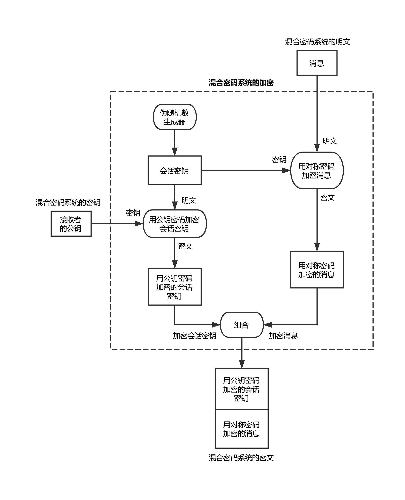
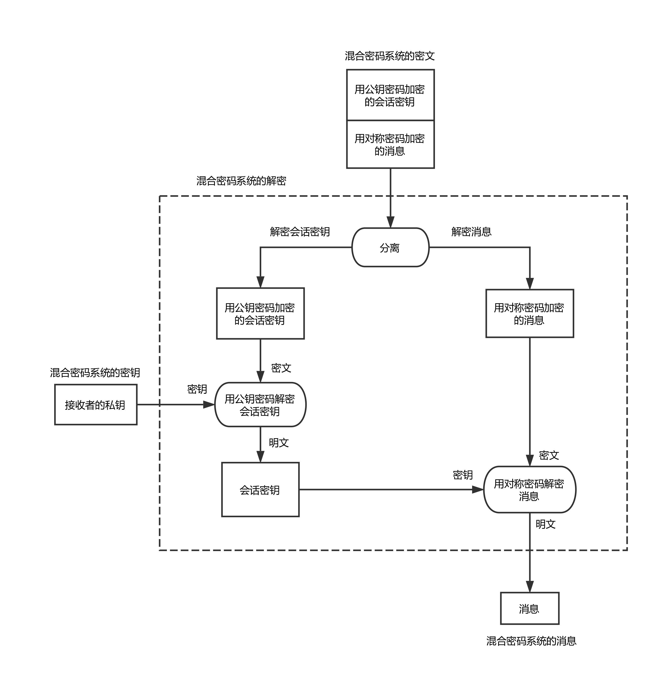

# 混合密码系统
混合密码系统用对称密码来加密明文，用公钥密码来加密对称密码中所使用的密钥。

混合密码系统中会先用快速的对称密码来对消息进行加密，这样消息就被转换为了密文，从而也就保证了消息的机密性。然后我们只要保证对称密码的密钥的机密性就可以了。这里就轮到公钥密码出场了，我们可以用公钥密码对加密消息时使用的对称密码的密钥进行加密。由于对称密码的密钥一般比消息本身要短，因此公钥密码速度慢的问题就可以忽略了。

使用对称密码提高速度（公钥密码的处理速度远远低于对称密码）

使用公钥密码解决对称密码所具有的密钥配送问题

## 加密

## 解密

