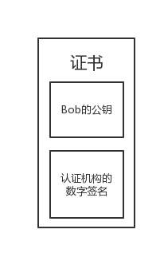

### 中间人攻击
1. Alice向Bob发送邮件索取公钥。  
“To Bob：请把你的公钥发给我。From Alice”
2. Mallory通过窃听发现Alice在向Bob索取公钥。
3. Bob看到Alice的邮件，并将自己的公钥发送给Alice。  
“To Alice：这是我的公钥。From Bob”
4. Mallory拦截Bob的邮件，使其无法发送给Alice。然后，他悄悄地将Bob的公钥保存起来，他稍后会用到Bob的公钥。
5. Mallory伪装成Bob，将自己的公钥发送给Alice。
6. Alice将自己的消息用Bob的公钥（其实是Mallory的公钥）进行加密。  
“To Bob：我爱你。From Alice”  
但是Alice所持有的并非Bob的公钥而是Mallory的公钥，因此Alice是用Mallory的公钥对邮件进行加密的。
7. Alice将加密后的消息发送给Bob。
8. Mallory拦截Alice的加密邮件。这封加密邮件是用Mallory的公钥进行加密的，因此Mallory能够对其进行解密，于是Mallory就看到了Alice发给Bob的情书。
9. Mallory伪装成Alice写一封假的邮件。  
“To Bob：我讨厌你。From Alice”（其实是Mallory）  
然后，他用4.中保存下来的Bob的公钥对这封假邮件进行加密，并发送给Bob。
10. Bob用自己的私钥对收到的邮件进行解密，然后他看到消息的内容是：  
“To Bob：我讨厌你。From Alice”  
他伤心极了。

### 证书
无论是公钥密码还是数字签名，其中公钥都扮演了重要的角色。  
然而，如果不能判断自己手上的公钥是否合法，就有可能遭到中间人攻击。  
证书，就是用来对公钥合法性提供证明的技术。

**公钥证书**和驾照很相似，里面记有姓名、组织、邮箱地址等个人信息，以及属于此人的公钥，并由**认证机构**施加数字签名。只要看到公钥证书，我们就可以知道认证机构认定该公钥的确属于此人。公钥证书也简称为**证书**。

### 证书的应用场景
1. Bob生成密钥对（一对公钥和私钥）
2. Bob在认证机构注册自己的公钥
3. 认证机构用自己的私钥对Bob的公钥施加数字签名并生成证书
4. Alice得到带有认证机构的数字签名的Bob的公钥（证书）
5. Alice使用认证机构的公钥验证数字签名，确认Bob的公钥的合法性
6. Alice用Bob的公钥加密消息并发送给Bob
7. Bob用自己的私钥解密密文得到Alice的消息

### 作废证书与CRL
当用户的私钥丢失、被盗时，认证机构需要对证书进行**作废**。此外，即便私钥安然无恙，有时候也需要作废证书。  
要作废证书，认证机构需要制作一张**证书作废清单**，简称为**CRL**。  
CRL是认证机构宣布作废的证书一览表，具体来说，是一张已作废的证书序列号的清单，并由认证机构加上数字签名。证书序列号是认证机构在颁发证书时所赋予的编号，在证书中都会记载。  
假设我们手上有Bob的证书，该证书有合法的认证机构签名，**而且也在有效期内**，但仅凭这些还不能说明该证书一定是有效的，还需要**查询认证机构最新的CRL，并确认该证书是否有效**。
